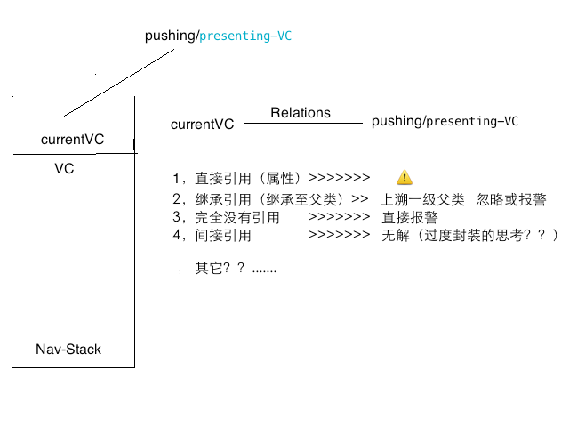

## ProbeRefCycles

以UINavigationController 和 UIViewController 为切入点实现简单粗暴的循环引用探测。

UIViewController 被推出大多情况下，应该被释放。通过hook  UINavigationController 相关方法，计时2s 没有被释放，通过调用

	#define Debugger()    { kill( getpid(), SIGINT ) ; }
	
实现断点预警。

## 场景

可以识别

*  pushing/presenting-VC 被currentVC 直接引用。

   >  pushing/presenting-VC 被推出后不会被释放，此时打印log 信息。
   
  log 信息如下
  
  >   ****[pushing/presenting-VC]**被[currentVC]的成员变量[xx]强引用**，在TableViewController pop后将不会被释放，如有必要，请忽略该条信息.
  
* 继承引用（继承至父类）。

  > currentVC 的父类 superCurrentVC  通过属性引用了 pushing/presenting-VC，  currentVC 通过继承拥有。
pushing/presenting-VC 被推出后不会被释放。

  针对上述情况，  默认会DeepSuperClass 一级，也可通过设置 pushing/presenting-VC 的属性 ProbeDeepSuperClassLevel  Deep 最大级数，直到查找到原生UIViewController 跳出。
  

	    push/present-VC.ProbeDeepSuperClassLevel = DeepAllSuperClassLevel ; 最大级数
             或
	    push/present-VC.ProbeDeepSuperClassLevel = DefaultDeepLevel ; 默认deep 一级

  
  显然上面情况是由封装过渡导致的，如在currentVC 继承链中找到了pushing/presenting-VC ，证明通过继承引用，发出log 信息。自然它被推出不会被释放。
 

* currentVC  和 pushing/presenting-VC 没有任何直接或间接关系

 > 如果pushing/presenting-VC 没有被释放，直接发出报警，命中断点。提醒开发人员此处 98%的概率有循环引用。

* 排除上面三种情况 ，忽略不处理。 *考虑这样实现是否得当*